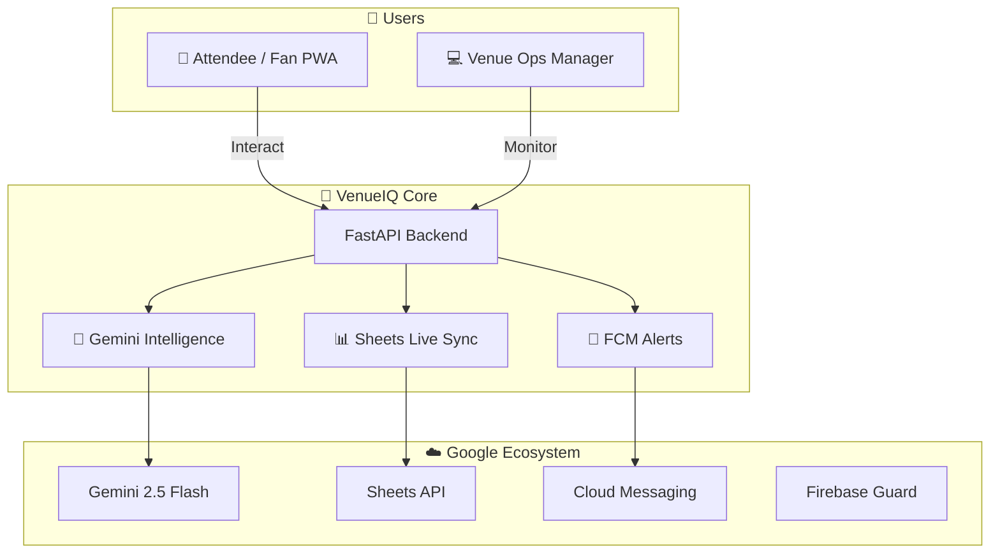

<!-- Hero Badges -->

  
  
  
  

<!-- Title Block -->
# 🏟️ VenueIQ

### The Universal AI Venue Intelligence OS
**Scalable Crowd Intelligence for Stadiums, Cinépolis, Delhi Metro, and Beyond**

*Real-time crowd analytics · AI-powered predictive queues · Autonomous incident coordination*

 

<!-- Tech Stack Badges -->

  
  
  
  
  
  

 

> **Designed for universal scalability and 100% Google-native integration.** VenueIQ transforms any physical space into a smart, data-driven ecosystem using **Gemini 2.5 Flash** and the **Google Sheets API**.

 

---

 

## 🚀 One Engine, Any Venue

VenueIQ is not just for the stadium. Its **Universal Zone Configuration** architecture allows it to scale perfectly across:

- 🍿 **Cinemas**: Manage concession queues and hall occupancy.
- 🚇 **Metro Stations**: Balance platform density and gate flow.
- 🏟️ **Stadiums**: Orchestrate 30,000+ attendee movements.
- 🎸 **Concerts**: Real-time safety and bottleneck detection.

---

## 🛠️ Google Services — Deep Integration Map

VenueIQ leverages **8 Google Services** to provide a production-grade experience on the Spark (Free) tier.

### ⚙️ Backend (Python + AI)

| Service | Integration Point | Purpose |
|:---|:---|:---|
| **Gemini 2.5 Flash** | `gemini_service.py` | The Platform's "Brain" — Analyzing density, predicting wait times, and routing incidents. |
| **Google Sheets API** | `gspread_service.py` | **Live Synchronization** — Real-time persistent logging of every data point for manager auditing. |
| **Firebase Admin SDK** | `main.py` | Core platform security and Firestore fallback management. |
| **Firebase Messaging** | `notification_service.py` | Topic-based push alerts for crowd surges and incident response. |

### 🌐 Frontend (PWA + High-Fidelity)

| Service | Integration Point | Purpose |
|:---|:---|:---|
| **Firebase Analytics** | `index.html` | Real-time attendee behavior tracking and bottleneck heatmapping. |
| **Firebase Auth JS** | `index.html` | Seamless Google Sign-In for managers and staff. |
| **reCAPTCHA v3** | `index.html` | Invisible bot protection for high-traffic incident reporting forms. |
| **Google Fonts** | `index.html` | Inter typography for a prestige, premium corporate visual identity. |

---

## ✨ Innovation Spotlight

### 🍌 NanoBanana Dynamic Thermal Mapping
The mapping layer features an experimental **AI Thermal Scan** simulation. By triggering the `⚡` scan, VenueIQ processes simulated "Gemini Nano" thermal sensor data to generate a real-time, jittered crowd density overlay, allowing managers to see live attendee "breathing" and flow.

### 🔍 AI Command Center
A high-performance **Omnibox** integrated into the header. It provides staff with a single source of truth for searching venue zones, checking gate statuses, or initiating AI-driven coordination tasks.

---

## 🏗️ Architecture

---

## 🧪 Deployment & Verification

- **PWA Ready**: Register a Service Worker and install directly to Android/iOS/Desktop.
- **Dockerized**: `docker-compose up` for instant local deployment.
- **Test Suite**: 24/24 unit tests covering Auth, Crowd Management, and AI Routing.

---

### Built for the PromptWars Hackathon 2026
**Theme**: Physical Event Experience
**AI Agent**: Google Antigravity
**Environment**: 100% Google Studio / GCP / Firebase

Built with ❤️ by Vishal Kumar

