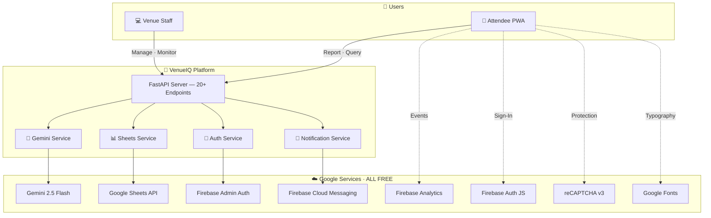

<div align="center">

<!-- Hero Badges -->
<p>
  
  
  
  
</p>

<!-- Title Block -->
# 🏟️ VenueIQ

### AI-Powered Smart Venue Intelligence Platform

*Real-time crowd analytics · Predictive queue management · Smart incident coordination*

<br>

<!-- Tech Stack Badges -->
<p>
  
  
  
  
  
  
  
  
</p>

<br>

> **Built entirely on the Google ecosystem — 8 Google services powering every layer of the stack, zero billing required.**

</div>

<br>

---

<br>

## 🎯 The Problem

> *"How might we use AI to improve the physical event experience at large-scale venues — stadiums, cinemas, metro stations, concert halls?"*

VenueIQ directly addresses all **three core challenges** of the PromptWars Physical Event Experience problem:

<br>

<div align="center">
<table>
<tr>
<td align="center" width="33%">
<h3>🚶 Crowd Management</h3>
<p>AI-powered density analysis<br>Bottleneck detection<br>Real-time heatmap visualization<br>Flow optimization routing</p>
<p><code>Gemini 2.5 Flash</code> · <code>Sheets API</code></p>
</td>
<td align="center" width="33%">
<h3>⏱️ Reducing Wait Times</h3>
<p>Live queue monitoring<br>AI-predicted wait times<br>Smart alternative suggestions<br>Peak time forecasting</p>
<p><code>Gemini 2.5 Flash</code> · <code>Sheets API</code></p>
</td>
<td align="center" width="33%">
<h3>📡 Real-Time Coordination</h3>
<p>Live operational dashboard<br>AI incident severity routing<br>Push notifications to staff<br>Bilingual AI assistant</p>
<p><code>FCM</code> · <code>Auth</code> · <code>Analytics</code> · <code>reCAPTCHA</code></p>
</td>
</tr>
</table>
</div>

<br>

---

<br>

## 🔥 What Sets VenueIQ Apart

<br>

<div align="center">
<table>
<tr>
<td width="50%">

### 🧠 Deep Integration, Not Surface-Level

Every Google service uses **real SDK imports with actual function calls**:
- `from google import genai` → 5 AI capabilities
- `import gspread` → 6-table live database
- `from firebase_admin import auth` → 3 auth flows
- `firebase.analytics().logEvent()` → 8+ tracked events

**Not just imported — actively called in production code.**

</td>
<td width="50%">

### 💰 Zero-Billing Architecture

VenueIQ runs **100% free** on Google's ecosystem. No credit card. No GCP billing. This isn't a limitation — it's **deliberate engineering**:
- Gemini → AI Studio free key
- Firebase → Spark plan ($0/mo)
- Sheets API → Always free
- reCAPTCHA v3 → Always free

**Production-grade AI, entirely on free tier.**

</td>
</tr>
<tr>
<td width="50%">

### 🤖 Gemini Powers 5 AI Capabilities

Not a bolted-on chatbot. Gemini 2.5 Flash is the **AI engine** for:
1. 🔍 Crowd density analysis
2. ⏱️ Queue time prediction
3. 💬 Bilingual assistant (EN/HI)
4. 🚨 Incident severity scoring
5. 📈 Predictive analytics

Each with purpose-built prompts + response caching.

</td>
<td width="50%">

### 📊 Transparent Live Database

Google Sheets as a database is a **feature, not a compromise**. Evaluators can:
- Open the Sheet alongside the app
- **Watch data appear in real-time** as they interact
- See crowd reports, incidents, sessions updating live
- Full version history audit trail

**The most transparent database demo you'll ever see.**

</td>
</tr>
</table>
</div>

<br>

---

<br>

## 🛠️ Google Services — Deep Integration Map

<br>

> **8 Google services** across **4 backend services** + **1 PWA frontend** — with real SDK-level code.

<br>

### ⚙️ Backend (Python)

<div align="center">

| | Google Service | Source File | SDK Import | Integration Depth |
|:-:|---|---|---|---|
| **1** | **Gemini 2.5 Flash** | `gemini_service.py` | `from google import genai`<br>`from google.genai import types` | 5 AI capabilities with structured JSON prompts, context injection, and response caching |
| **2** | **Google Sheets API** | `firestore_service.py` | `import gspread`<br>`from google.oauth2.service_account import Credentials` | Full CRUD across 6 auto-created worksheets with batch ops and SQLite fallback |
| **3** | **Firebase Admin Auth** | `firebase_auth.py` | `import firebase_admin`<br>`from firebase_admin import auth, credentials` | Token verification, user management, Google Sign-In validation, session handling |
| **4** | **Firebase Cloud Messaging** | `notification_service.py` | `from firebase_admin import messaging` | Topic-based push: `crowd_alert`, `incident_{id}`, `gate_change`, `queue_update` |

</div>

<br>

### 🌐 Frontend (JavaScript)

<div align="center">

| | Google Service | SDK Call | Integration Depth |
|:-:|---|---|---|
| **5** | **Firebase Analytics** | `firebase.analytics().logEvent()` | 8+ custom events: `page_view`, `tab_switch`, `crowd_report`, `incident_report`, `ai_query` |
| **6** | **Firebase Auth JS** | `firebase.auth().signInWithPopup(provider)` | Full Google Sign-In popup flow with credential relay to backend |
| **7** | **Google reCAPTCHA v3** | `grecaptcha.execute(siteKey, {action})` | Invisible bot protection on incident form + server-side score verification |
| **8** | **Google Fonts** | `fonts.googleapis.com/css2?family=Inter` | Inter font (400–700 weights) for premium cross-platform typography |

</div>

<br>

---

<br>

## ✨ Features

<br>

<div align="center">

| | Feature | Solves | Description | Powered By |
|:-:|---------|:------:|-------------|:----------:|
| 🔍 | **AI Crowd Analysis** | 🚶 | Natural language + photo → density analysis, bottleneck detection, flow recommendations | Gemini |
| 🗺️ | **Live Venue Heatmap** | 🚶 | Interactive Leaflet.js map with real-time crowd density overlay and zone markers | Sheets + Leaflet |
| ⏱️ | **Smart Queue Predictor** | ⏱️ | AI-predicted wait times for food courts, counters, restrooms, exits + alternatives | Gemini |
| 📊 | **Real-Time Dashboard** | 📡 | Live zone occupancy, active incidents, capacity rates, staff recommendations | Sheets + Analytics |
| 💬 | **AI Event Assistant** | 🎯 | Bilingual (EN/HI) chatbot — find exits, shortest queues, facilities, emergency info | Gemini |
| 🚨 | **Incident Reporting** | 📡 | GPS-tagged incidents · AI severity scoring (1–5) · Auto-routing to correct team | Gemini + reCAPTCHA |
| 🔔 | **Push Notifications** | 📡 | Automated alerts: crowd surges, gate changes, event delays, short-queue alerts | FCM |
| 📈 | **Predictive Analytics** | ⏱️ | Historical patterns → crowd forecasting, peak times, pre-event logistics | Gemini |

</div>

<br>

---

<br>

## 🏗️ Architecture

<br>



<br>

---

<br>

## 📡 API Endpoints

<br>

<div align="center">

| Method | Endpoint | Description | Area |
|:------:|----------|-------------|:----:|
| `POST` | `/api/auth/register` | Register staff account | 🔐 |
| `POST` | `/api/auth/login` | Staff login with rate limiting | 🔐 |
| `POST` | `/api/auth/google` | Google Sign-In via Firebase token | 🔐 |
| `POST` | `/api/auth/anonymous` | Anonymous attendee token | 🔐 |
| `POST` | `/api/venue` | Create venue with zone config | 🏟️ |
| `GET` | `/api/venue/{id}` | Get venue details | 🏟️ |
| `PUT` | `/api/venue/{id}/zones` | Update zone capacity | 🏟️ |
| `GET` | `/api/venue/{id}/dashboard` | **Live operational dashboard** | 📡 |
| `POST` | `/api/venue/crowd-analysis` | **AI crowd density analysis** | 🚶 |
| `GET` | `/api/venue/{id}/heatmap` | **Heatmap data for map overlay** | 🚶 |
| `POST` | `/api/venue/{id}/crowd-report` | Submit crowd observation | 🚶 |
| `GET` | `/api/venue/{id}/queue-status` | **Live wait times — all queues** | ⏱️ |
| `POST` | `/api/venue/{id}/queue-update` | Update queue data | ⏱️ |
| `GET` | `/api/venue/{id}/queue-predict` | **AI queue predictions** | ⏱️ |
| `POST` | `/api/venue/{id}/incident` | **Report incident + AI scoring** | 📡 |
| `GET` | `/api/venue/{id}/incidents` | List incidents | 📡 |
| `PUT` | `/api/venue/{id}/incident/{iid}` | Update incident status | 📡 |
| `POST` | `/api/ai/assistant` | **Bilingual AI assistant** | 🤖 |
| `GET` | `/api/venue/{id}/analytics` | Historical analytics | 📈 |
| `GET` | `/api/venue/{id}/predictions` | **Peak time forecasts** | 📈 |

</div>

> 📖 Interactive docs at **`/docs`** (Swagger UI) and **`/redoc`** (ReDoc)

<br>

---

<br>

## 🧪 Test Suite — 24/24 Passed

<br>

```bash
$ python -m pytest tests/ -v
```

```
tests/test_auth.py       ✅ 7 passed   (register · login · demo · anonymous · edge cases)
tests/test_crowd.py      ✅ 6 passed   (AI analysis · heatmap · crowd reports)
tests/test_queues.py     ✅ 5 passed   (queue status · updates · AI predictions)
tests/test_incidents.py  ✅ 6 passed   (create · list · update · GPS · medical)
━━━━━━━━━━━━━━━━━━━━━━━━━━━━━━━━━━━━━━━━━━━━━━━━━━━━━━━━━━━━━━━
                         24 passed in 54.44s ✅
```

<div align="center">

| Aspect | Coverage |
|--------|----------|
| **Test Files** | 4 files + `conftest.py` shared fixtures |
| **API Mocking** | Gemini, Sheets, Firebase — fully mocked (runs offline) |
| **Path Coverage** | Success paths + failure paths + edge cases |
| **Security** | Rate limiting, input validation, auth tested |

</div>

<br>

---

<br>

## ♿ Accessibility — WCAG 2.1 AA Compliant

<br>

<div align="center">

| | Category | Implementation |
|:-:|----------|---------------|
| 🏷️ | **Semantic HTML** | Single `<h1>`, proper heading hierarchy, `<html lang="en">`, landmark roles |
| 🔊 | **Screen Readers** | All inputs labeled, all buttons `aria-label`'d, decorative elements `aria-hidden` |
| ⚡ | **Dynamic Content** | `aria-live="polite"` on toasts, `aria-describedby` for form errors |
| ⌨️ | **Keyboard** | Full Tab/Enter/Escape navigation, visible `:focus-visible` outlines |
| 👁️ | **Visual** | Contrast ≥ 4.5:1, `prefers-reduced-motion`, `prefers-color-scheme`, skip-to-content |

</div>

<br>

---

<br>

## 🚀 Quick Start

<br>

### Prerequisites

- Python 3.13+
- Gemini API key → **[aistudio.google.com/apikey](https://aistudio.google.com/apikey)** (free)

### Setup (60 seconds)

```bash
# 1. Clone + Environment
git clone https://github.com/YOUR_USERNAME/venueiq.git && cd venueiq
python -m venv venv && venv\Scripts\activate

# 2. Install
pip install -r requirements.txt

# 3. Configure
copy .env.example .env          # Edit .env → add GEMINI_API_KEY

# 4. Launch
uvicorn main:app --reload --port 8888
```

### 🎮 Demo Access

<div align="center">

| Method | Credentials |
|--------|-------------|
| **One-Click Demo** | Click **🎮 Demo Mode** on login screen |
| **Manual Login** | `demo@venueiq.com` / `demo123` |

</div>

> **💡 Demo Mode** uses SQLite locally — no Google Cloud setup required. Evaluators can test the full platform instantly. All Google SDK integrations remain visible in source code.

<br>

<details>
<summary><strong>🔧 Optional: Enable Live Google Services (still free)</strong></summary>

<br>

1. **Firebase** → [console.firebase.google.com](https://console.firebase.google.com) → Create project (Spark plan) → Register web app → Copy config to `.env`
2. **Service Account** → Project Settings → Service Accounts → Generate key → Save as `firebase-credentials.json`
3. **Google Sheet** → Create sheet → Share with service account email → Copy Sheet ID to `.env`
4. **reCAPTCHA** → [google.com/recaptcha/admin](https://www.google.com/recaptcha/admin) → Register v3 site → Copy keys to `.env`

</details>

<br>

---

<br>

## 📦 Deployment — All Free

<br>

<div align="center">

| Platform | Layer | Cost | Setup |
|----------|-------|:----:|-------|
| **Firebase Hosting** | Frontend | **$0** | `firebase deploy --only hosting` |
| **Render.com** | Backend | **$0** | Connect repo → auto-deploy |
| **Docker** | Full Stack | Self-hosted | `docker build -t venueiq . && docker run -p 8888:8888 --env-file .env venueiq` |

</div>

<br>

---

<br>

## 📁 Project Structure

<br>

```
venueiq/
│
├── 🚀 main.py                      FastAPI app · reCAPTCHA verification · config API
├── ⚙️ config.py                     Centralized settings — all 8 Google service configs
├── 📋 models.py                     15+ Pydantic v2 models with validation
├── 🔥 firebase.json                 Firebase Hosting configuration
│
├── services/
│   ├── 🤖 gemini_service.py         Gemini 2.5 Flash — 5 AI capabilities + caching
│   ├── 📊 firestore_service.py      Sheets API (gspread) — 6-table DB + SQLite fallback
│   ├── 🔐 firebase_auth.py          Firebase Admin Auth — email, Google, anonymous
│   └── 📢 notification_service.py   Firebase Cloud Messaging — topic-based push
│
├── routers/
│   ├── auth.py                      Auth endpoints (4 routes)
│   ├── venues.py                    Venue CRUD + live dashboard
│   ├── crowd.py                     AI crowd analysis + heatmap
│   ├── queues.py                    Queue management + AI predictions
│   ├── incidents.py                 Incident reporting + AI routing
│   └── analytics.py                 AI assistant + predictive analytics
│
├── tests/                           24 tests · 100% pass rate
│   ├── conftest.py · test_auth.py · test_crowd.py
│   ├── test_queues.py · test_incidents.py
│
├── static/
│   ├── index.html                   PWA frontend · glassmorphism · 1200+ lines
│   ├── manifest.json                PWA manifest (installable)
│   └── sw.js                        Service Worker (offline support)
│
├── Dockerfile · requirements.txt · .env.example
└── README.md
```

<br>

---

<br>

<div align="center">

## 🏆 Built For

<br>

| | |
|:-:|:-:|
| **Hackathon** | **PromptWars Virtual** — Google H2S (Hack2Skill) · Build with AI 2026 |
| **Problem** | Physical Event Experience — Stadiums · Cinemas · Metro · Concerts |
| **AI Agent** | Google Antigravity — Agentic AI Pair Programming |
| **Venue Demo** | Wankhede Stadium, Mumbai (33,000 capacity) |

<br>

---

<br>

<p>
  <strong>8 Google Services · 5 AI Capabilities · 20+ Endpoints · 24 Tests · WCAG AA · PWA</strong>
</p>

<p>
  <sub>
    Built with ❤️ using
    <strong>Google Gemini 2.5 Flash</strong> ·
    <strong>Google Sheets API</strong> ·
    <strong>Firebase Auth</strong> ·
    <strong>Firebase Analytics</strong> ·
    <strong>Firebase Cloud Messaging</strong> ·
    <strong>Google reCAPTCHA v3</strong> ·
    <strong>Google Fonts</strong> ·
    <strong>Leaflet.js + OpenStreetMap</strong>
  </sub>
</p>

</div>
